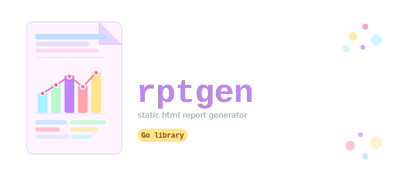

# RPTGEN: A Go Report Generator

[](https://github.com/lfrystak/rptgen/actions/workflows/ci.yml)
[](https://sonarcloud.io/summary/new_code?id=rptgen)
[](https://go.dev/dl/)
[](LICENSE.txt)
[](https://github.com/lfrystak/rptgen/releases/latest)




`rptgen` is a Go library for building structured, self-contained HTML reports. You compose a report from typed elements — tiles, tables, charts, and free text — arrange them into multi-column sections, and render everything to a single HTML file with no external dependencies.

Reports are themed via a `Theme` struct that controls colors, fonts, shadows, and animations. A built-in default theme is provided; custom themes only require overriding the fields you care about.

## Installation

```sh
go get github.com/lfrystak/rptgen
```

## Minimal Example

```go
package main

import (
    "log"
    "os"

    "github.com/lfrystak/rptgen"
)

func main() {
    report := rptgen.NewReport("Monthly Summary")
    report.Footer = "Internal use only"

    section := rptgen.NewSection("KPIs", 1, 1)

    rev := rptgen.NewNumberTile("Revenue", 98000)
    rev.Format = "%.0f"
    rev.Prefix = "$"
    rev.ThousandsSep = true
    section.AddElement(rev)

    growth := rptgen.NewNumberTile("Growth", 12.0)
    growth.Format = "%.1f%%"
    section.AddElement(growth)
    report.AddSection(section)

    f, err := os.Create("report.html")
    if err != nil {
        log.Fatal(err)
    }
    defer f.Close()
    if err := rptgen.HtmlRenderer{}.Render(f, report, nil); err != nil { // nil = default theme
        log.Fatal(err)
    }
}
```

## Report Structure

### `Report`

The top-level document container. Created with `NewReport(title)`.

| Field         | Type       | Description                                      |
|---------------|------------|--------------------------------------------------|
| `Title`       | `string`   | Report heading displayed in the HTML header.     |
| `Sections`    | `[]*Section` | Ordered list of content sections.              |
| `GeneratedAt` | `time.Time` | Timestamp shown in the header. Set automatically by `NewReport`. |
| `Footer`      | `string`   | Text shown at the bottom of the page.            |
| `LogoURL`     | `string`   | URL of a logo image rendered above the title.    |

```go
report := rptgen.NewReport("Q2 Report")
report.LogoURL = "https://example.com/logo.png"
report.Footer  = "Confidential"
```

### `Section`

A section groups elements into a CSS grid row within a `Report`.
`Section` is a layout row; it is not itself an `Element`. Use [`Canvas`](#canvas) when you need a nestable sub-grid element placed inside a section column.

| Field          | Type       | Description                                                                 |
|----------------|------------|-----------------------------------------------------------------------------|
| `Title`        | `string`   | Section heading. Empty = no heading.                                        |
| `Elements`     | `[]Element` | Ordered list of elements in the section.                                   |
| `ColumnWidths` | `[]int`    | Proportional column widths. `[]int{1, 2}` = 33 %/67 %. Nil = one column. |

```go
// Single column (no widths)
section := rptgen.NewSection("Summary")

// Two equal columns
section := rptgen.NewSection("Revenue", 1, 1)

// Four equal columns via EqualColumns helper
section := rptgen.NewSection("KPIs", rptgen.EqualColumns(4)...)

// Custom ratio: 33%/67%
section := rptgen.NewSection("Charts", 1, 2)

section.AddElement(chart1)
section.AddElement(chart2)
report.AddSection(section)
```

### Elements

#### `NumberTile`

Displays a single numeric metric.

| Field          | Type      | Description                                                              |
|----------------|-----------|--------------------------------------------------------------------------|
| `Title`        | `string`  | Label above the value.                                                   |
| `Value`        | `float64` | The numeric value to display.                                            |
| `Format`       | `string`  | `fmt.Sprintf` format string, e.g. `"%.2f"`, `"%.1f%%"`. Empty = raw number. |
| `Prefix`       | `string`  | String prepended to the formatted value, e.g. `"$"`, `"€"`.            |
| `ThousandsSep` | `bool`    | Insert comma thousands separators into the integer part.                 |
| `Subtitle`     | `string`  | Small caption below the value (e.g. `"↑ vs last month"`).               |
| `Tooltip`      | `string`  | Hover text on the tile card.                                             |

```go
rev := rptgen.NewNumberTile("Revenue", 98000)
rev.Format = "%.0f"
rev.Prefix = "$"
rev.ThousandsSep = true

growth := rptgen.NewNumberTile("Growth", 12.0)
growth.Format = "%.1f%%"
growth.Subtitle = "↑ vs Q1"

score := rptgen.NewNumberTile("Score", 4.7)
score.Format = "%.1f"
score.Tooltip = "Out of 5"
```

#### `DateTile`

Displays a date or datetime metric.

| Field      | Type        | Description                                                          |
|------------|-------------|----------------------------------------------------------------------|
| `Title`    | `string`    | Label above the value.                                               |
| `Value`    | `time.Time` | The time value. Zero value renders as empty.                         |
| `Format`   | `string`    | Go time layout string. Empty = `"2006-01-02 15:04:05"`.             |
| `Subtitle` | `string`    | Small caption below the date.                                        |
| `Tooltip`  | `string`    | Hover text on the tile card.                                         |

```go
tile := rptgen.NewDateTile("Quarter End", time.Date(2024, 6, 30, 0, 0, 0, 0, time.UTC))
tile.Format = "January 02, 2006"
```

#### `FreeText`

Displays a block of plain text or raw HTML.

| Field     | Type     | Description                                                         |
|-----------|----------|---------------------------------------------------------------------|
| `Content` | `string` | The text (or HTML) to render.                                       |
| `IsHTML`  | `bool`   | If `true`, `Content` is injected as-is. If `false`, it is escaped. |

> **Security note:** When `IsHTML` is `true`, `Content` is written into the document verbatim
> with **no escaping**. If the value originates from user input or any untrusted source you
> must sanitize it (e.g. with [bluemonday](https://github.com/microcosm-cc/bluemonday)) before
> passing it to `FreeText`. Failing to do so allows stored XSS.

```go
rptgen.NewFreeText("Plain paragraph text.")

html := rptgen.NewFreeText("<p>Rich <strong>HTML</strong> content.</p>")
html.IsHTML = true
```

#### `Table`

Displays tabular data with a header row.

| Field     | Type              | Description                                               |
|-----------|-------------------|-----------------------------------------------------------|
| `Title`   | `string`          | Caption above the table.                                  |
| `Columns` | `[]string`        | Ordered column names used as headers and row-map keys.    |
| `Rows`    | `[]map[string]any` | Row data. Each map key must match a column name.         |

Three constructors are available:

```go
// Infer columns from first row keys (sorted alphabetically)
rptgen.NewTable("Sales", rows)

// Explicit column order
rptgen.NewTableWithColumns("Sales", rows, []string{"Customer", "Revenue", "Status"})

// Column-oriented input
rptgen.NewTableFromColumns("Sales", map[string][]any{
    "Customer": {"Acme", "TechCo"},
    "Revenue":  {45000, 38000},
})
```

#### `Canvas`

A nestable sub-grid element placed inside a `Section` column.
Unlike `Section` (a top-level layout row), `Canvas` is itself an `Element` and can be nested at any depth.

| Field          | Type       | Description                                                              |
|----------------|------------|--------------------------------------------------------------------------|
| `ColumnWidths` | `[]int`    | Proportional widths for columns within the canvas.                       |
| `Elements`     | `[]Element` | Elements placed inside the canvas grid.                                 |

```go
canvas := rptgen.NewCanvas(rptgen.EqualColumns(2)...) // two equal columns
canvas.AddElement(&rptgen.NumberTile{Title: "Users", Value: 500, Format: "%.0f", ThousandsSep: true})
canvas.AddElement(rptgen.NewBarChart("Trend", data))

section := &rptgen.Section{ColumnWidths: []int{1, 2}}
section.AddElement(canvas)       // occupies the first (narrower) column
section.AddElement(anotherChart) // occupies the second (wider) column
```

### Charts

Charts are rendered using Chart.js, embedded inline — no CDN calls required.

#### `BarChart`

Single-series vertical or horizontal bar chart.

| Field          | Type            | Description                                                     |
|----------------|-----------------|-----------------------------------------------------------------|
| `Title`        | `string`        | Chart heading.                                                  |
| `Data`         | `[]DataPoint`   | Ordered label-value pairs. Axis order matches slice order.      |
| `IsHorizontal` | `bool`          | Render bars horizontally if `true`.                             |
| `Tooltip`      | `string`        | Hover text on the chart card.                                   |

```go
chart := rptgen.NewBarChart("Sales by Region", []rptgen.DataPoint{
    {Label: "Asia Pacific",  Value: 142000},
    {Label: "North America", Value: 125000},
    {Label: "Europe",        Value: 98000},
    {Label: "Latin America", Value: 67000},
})
chart.IsHorizontal = true
```

> **Ordering note:** `[]DataPoint` preserves the order you specify.
> If you have a `map[string]float64` and alphabetical order is acceptable,
> use `rptgen.DataPointsFromMap(m)` as a convenience converter.

#### `LineChart`

Line chart with one or more named series.

| Field        | Type           | Description                                         |
|--------------|----------------|-----------------------------------------------------|
| `Title`      | `string`       | Chart heading.                                      |
| `Series`     | `[]LineSeries` | Ordered slice of series (preserves legend order).   |
| `ShowPoints` | `bool`         | Show data point dots. Default: `true`.              |
| `Tooltip`    | `string`       | Hover text on the chart card.                       |

Each `LineSeries` has:

| Field    | Type            | Description                                                 |
|----------|-----------------|-------------------------------------------------------------|
| `Name`   | `string`        | Series label in legend.                                     |
| `Points` | `[]DataPoint`   | Ordered label-value pairs. Axis order matches slice order.  |

```go
// Single series
chart := rptgen.NewLineChartSingle("Monthly Revenue", []rptgen.DataPoint{
    {Label: "January", Value: 45000},
    {Label: "February", Value: 52000},
    {Label: "March", Value: 48000},
})

// Multiple series
chart := rptgen.NewLineChart("Revenue vs Costs", []rptgen.LineSeries{
    {Name: "Revenue", Points: []rptgen.DataPoint{{Label: "Q1", Value: 145000}, {Label: "Q2", Value: 174000}}},
    {Name: "Costs",   Points: []rptgen.DataPoint{{Label: "Q1", Value: 95000},  {Label: "Q2", Value: 102000}}},
})
```

#### `PieChart`

Pie or donut chart.

| Field     | Type            | Description                                                    |
|-----------|-----------------|----------------------------------------------------------------|
| `Title`   | `string`        | Chart heading.                                                 |
| `Data`    | `[]DataPoint`   | Ordered label-value pairs. Legend order matches slice order.   |
| `IsDonut` | `bool`          | Render as donut (hollow center) if `true`.                     |
| `Tooltip` | `string`        | Hover text on the chart card.                                  |

```go
chart := rptgen.NewPieChart("Product Mix", []rptgen.DataPoint{
    {Label: "Enterprise",   Value: 45},
    {Label: "Professional", Value: 30},
    {Label: "Starter",      Value: 25},
})
chart.IsDonut = true
```

#### `StackedBarChart`

Stacked bar chart where each bar segment represents a named series.

| Field          | Type                  | Description                                    |
|----------------|-----------------------|------------------------------------------------|
| `Title`        | `string`              | Chart heading.                                 |
| `Series`       | `[]StackedBarSeries`  | Ordered slice of categories (preserves order). |
| `IsHorizontal` | `bool`                | Render bars horizontally if `true`.            |
| `Tooltip`      | `string`              | Hover text on the chart card.                  |

Each `StackedBarSeries` has:

| Field      | Type                 | Description                                    |
|------------|----------------------|------------------------------------------------|
| `Category` | `string`             | The bar label (e.g. `"Q1"`).                   |
| `Values`   | `map[string]float64` | Series name → value for each segment.          |

```go
chart := rptgen.NewStackedBarChart("Quarterly Performance", []rptgen.StackedBarSeries{
    {Category: "Q1", Values: map[string]float64{"Revenue": 145000, "Costs": 95000}},
    {Category: "Q2", Values: map[string]float64{"Revenue": 174000, "Costs": 102000}},
})
```

## Theming

`Theme` controls the visual appearance of the rendered report.

```go
theme := rptgen.DefaultTheme()
theme.PrimaryColor   = "#059669" // override specific fields
theme.FontFamily     = "Georgia, serif"

err = rptgen.HtmlRenderer{}.Render(f, report, theme)
```

Pass `nil` as the theme to use `DefaultTheme()` with no overrides.

| Field             | Type       | Default                      | Description                                                         |
|-------------------|------------|------------------------------|---------------------------------------------------------------------|
| `PrimaryColor`    | `string`   | `#2563eb`                    | Headings, accents.                                                  |
| `SecondaryColor`  | `string`   | `#64748b`                    | Secondary text and borders.                                         |
| `BackgroundColor` | `string`   | `#f1f5f9`                    | Page background.                                                    |
| `CardColor`       | `string`   | `#ffffff`                    | Element card/tile background.                                       |
| `TextColor`       | `string`   | `#1e293b`                    | Body text.                                                          |
| `AccentColor`     | `string`   | `#10b981`                    | Accent color; reserved for use in custom elements (see extensibility). |
| `FontFamily`      | `string`   | System UI stack              | CSS `font-family` value.                                            |
| `BorderRadius`    | `string`   | `0.5rem`                     | Card corner radius.                                                 |
| `ChartColors`     | `[]string` | Eight-color palette          | Colors cycled through chart series.                                 |
| `ShadowIntensity` | `string`   | `"medium"`                   | `"none"`, `"subtle"`, `"medium"`, `"strong"`.                      |
| `EnableAnimations`| `bool`     | `true`                       | CSS entry animations on cards.                                      |
| `EnableGradients` | `bool`     | `false`                      | Adds a linear gradient to the report header background.             |

## Renderer

`HtmlRenderer` is the built-in renderer. It produces a fully self-contained HTML document — all CSS and Chart.js JavaScript are embedded inline.

```go
f, err := os.Create("report.html")
if err != nil {
    log.Fatal(err)
}
defer f.Close()
err = rptgen.HtmlRenderer{}.Render(f, report, theme)
```

For cases where a string is more convenient (tests, in-memory use), use `RenderString`:

```go
html, err := rptgen.HtmlRenderer{}.RenderString(report, theme)
```

### Custom elements

Any type that implements the `HTMLRenderer` interface is renderable by `HtmlRenderer`
without modifying the library. Implement `RenderHTML` to return the HTML fragment and
any Chart.js initialisation scripts for your element:

```go
type HTMLRenderer interface {
    RenderHTML(ctx *HTMLRenderContext) (html string, scripts []string, err error)
}
```

`HTMLRenderContext` exposes the active `*Theme`, `NextID` for stable canvas IDs, and
`ChartColors` for the colour palette.

### Custom document renderers

To produce output in a format other than HTML (e.g. Markdown, PDF), implement the
`Renderer` interface:

```go
type Renderer interface {
    Render(w io.Writer, report *Report, theme *Theme) error
}
```
